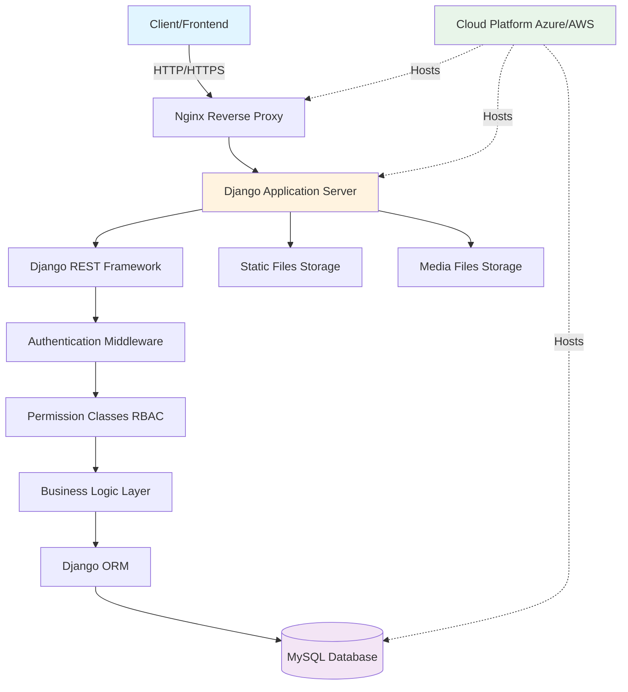

<div align="center">

# ✨ Cloud-Hosted Blogging Platform


<p align="center">
  
</p>

**A production-ready blogging platform with enterprise-grade security, role-based access control, and RESTful API architecture.**

[Features](#-features) • [Tech Stack](#-tech-stack) • [Installation](#-installation) • [API Documentation](#-api-documentation) • [Architecture](#-system-architecture)

</div>

---

## 📑 Table of Contents

- [Overview](#-overview)
- [Features](#-features)
- [Tech Stack](#-tech-stack)
- [System Architecture](#-system-architecture)
- [Database Schema](#-database-schema)
- [Installation](#-installation)
- [API Documentation](#-api-documentation)
- [Role-Based Access Control](#-role-based-access-control)
- [Security Features](#-security-features)
- [Future Enhancements](#-future-enhancements)
- [Contributing](#-contributing)
- [Contact](#-contact)

---

## 🎯 Overview


The **Cloud-Hosted Blogging Platform** is a Django-based backend system designed to provide a secure, scalable solution for content management. Built with modern web development best practices, this platform demonstrates enterprise-level architecture with role-based access control (RBAC), RESTful API design, and cloud deployment capabilities.

### 🎯 Project Goals

- ✅ Implement secure authentication and authorization
- ✅ Design scalable RESTful APIs
- ✅ Optimize database queries for performance
- ✅ Deploy on cloud infrastructure
- ✅ Follow clean code principles and best practices

### 📅 Development Timeline

**Duration:** March 2025 - May 2025 (3 months)

---

## ✨ Features

<table>
<tr>
<td width="50%">

### 🔐 Security & Authentication
- JWT-based authentication
- Secure password hashing (bcrypt)
- CSRF protection
- Role-based access control (RBAC)
- Session management
- Rate limiting for API endpoints

</td>
<td width="50%">

### 📝 Blog Management
- Create, Read, Update, Delete (CRUD) operations
- Draft and publish workflows
- Rich text editor support
- Image upload functionality
- Tag and category management
- Search and filter capabilities

</td>
</tr>
<tr>
<td width="50%">

### 👥 User Roles
- **Admin**: Full system access
- **Editor**: Create and edit content
- **Reader**: View published content
- Custom permission groups
- Role assignment and management

</td>
<td width="50%">

### 🚀 Performance
- Optimized MySQL queries
- Database indexing
- Query caching
- Pagination for large datasets
- Lazy loading
- API response optimization

</td>
</tr>
</table>

---

## 🛠️ Tech Stack

<div align="center">

### Backend Framework


### Database


### Authentication & Security


### Cloud & Deployment


### Development Tools


</div>

---

## 🏗️ System Architecture


### Architecture Layers

1. **Presentation Layer**: REST API endpoints
2. **Business Logic Layer**: Django views and serializers
3. **Data Access Layer**: Django ORM with optimized queries
4. **Database Layer**: MySQL with proper indexing and relationships

---

## 💾 Database Schema
```sql
-- Core Tables

-- Users Table (Extended Django User Model)
CREATE TABLE users (
    id INT PRIMARY KEY AUTO_INCREMENT,
    username VARCHAR(150) UNIQUE NOT NULL,
    email VARCHAR(254) UNIQUE NOT NULL,
    password VARCHAR(128) NOT NULL,
    role ENUM('admin', 'editor', 'reader') DEFAULT 'reader',
    is_active BOOLEAN DEFAULT TRUE,
    created_at TIMESTAMP DEFAULT CURRENT_TIMESTAMP,
    updated_at TIMESTAMP DEFAULT CURRENT_TIMESTAMP ON UPDATE CURRENT_TIMESTAMP
);

-- Blog Posts Table
CREATE TABLE blog_posts (
    id INT PRIMARY KEY AUTO_INCREMENT,
    title VARCHAR(255) NOT NULL,
    slug VARCHAR(255) UNIQUE NOT NULL,
    content TEXT NOT NULL,
    author_id INT NOT NULL,
    status ENUM('draft', 'published', 'archived') DEFAULT 'draft',
    featured_image VARCHAR(255),
    created_at TIMESTAMP DEFAULT CURRENT_TIMESTAMP,
    updated_at TIMESTAMP DEFAULT CURRENT_TIMESTAMP ON UPDATE CURRENT_TIMESTAMP,
    published_at TIMESTAMP NULL,
    FOREIGN KEY (author_id) REFERENCES users(id) ON DELETE CASCADE,
    INDEX idx_status (status),
    INDEX idx_author (author_id),
    INDEX idx_published (published_at)
);

-- Categories Table
CREATE TABLE categories (
    id INT PRIMARY KEY AUTO_INCREMENT,
    name VARCHAR(100) UNIQUE NOT NULL,
    slug VARCHAR(100) UNIQUE NOT NULL,
    description TEXT,
    created_at TIMESTAMP DEFAULT CURRENT_TIMESTAMP
);

-- Tags Table
CREATE TABLE tags (
    id INT PRIMARY KEY AUTO_INCREMENT,
    name VARCHAR(50) UNIQUE NOT NULL,
    slug VARCHAR(50) UNIQUE NOT NULL,
    created_at TIMESTAMP DEFAULT CURRENT_TIMESTAMP
);

-- Many-to-Many Relationships
CREATE TABLE post_categories (
    post_id INT,
    category_id INT,
    PRIMARY KEY (post_id, category_id),
    FOREIGN KEY (post_id) REFERENCES blog_posts(id) ON DELETE CASCADE,
    FOREIGN KEY (category_id) REFERENCES categories(id) ON DELETE CASCADE
);

CREATE TABLE post_tags (
    post_id INT,
    tag_id INT,
    PRIMARY KEY (post_id, tag_id),
    FOREIGN KEY (post_id) REFERENCES blog_posts(id) ON DELETE CASCADE,
    FOREIGN KEY (tag_id) REFERENCES tags(id) ON DELETE CASCADE
);
```

### ER Diagram
```
┌─────────────┐       ┌──────────────┐       ┌─────────────┐
│   Users     │       │  Blog Posts  │       │ Categories  │
├─────────────┤       ├──────────────┤       ├─────────────┤
│ id (PK)     │◄──────┤ id (PK)      │───────┤ id (PK)     │
│ username    │   1:N │ title        │  M:N  │ name        │
│ email       │       │ content      │       │ slug        │
│ role        │       │ author_id FK │       │ description │
│ is_active   │       │ status       │       └─────────────┘
└─────────────┘       │ created_at   │
                      └──────────────┘
                            │
                            │ M:N
                            │
                      ┌─────────────┐
                      │    Tags     │
                      ├─────────────┤
                      │ id (PK)     │
                      │ name        │
                      │ slug        │
                      └─────────────┘
```

---

## 🚀 Installation

### Prerequisites

- Python 3.9 or higher
- MySQL 8.0 or higher
- pip (Python package manager)
- Git

### Step 1: Clone the Repository
```bash
git clone https://github.com/NihaRuksar/blogging-platform.git
cd blogging-platform
```

### Step 2: Create Virtual Environment
```bash
# Windows
python -m venv venv
venv\Scripts\activate

# macOS/Linux
python3 -m venv venv
source venv/bin/activate
```

### Step 3: Install Dependencies
```bash
pip install -r requirements.txt
```

### Step 4: Configure Database

Create a `.env` file in the project root:
```env
# Database Configuration
DB_NAME=blogging_platform
DB_USER=your_mysql_user
DB_PASSWORD=your_mysql_password
DB_HOST=localhost
DB_PORT=3306

# Django Settings
SECRET_KEY=your-secret-key-here
DEBUG=True
ALLOWED_HOSTS=localhost,127.0.0.1

# JWT Settings
JWT_SECRET_KEY=your-jwt-secret-key
JWT_ALGORITHM=HS256
ACCESS_TOKEN_EXPIRE_MINUTES=30
```

### Step 5: Create MySQL Database
```bash
mysql -u root -p
```
```sql
CREATE DATABASE blogging_platform CHARACTER SET utf8mb4 COLLATE utf8mb4_unicode_ci;
EXIT;
```

### Step 6: Run Migrations
```bash
python manage.py makemigrations
python manage.py migrate
```

### Step 7: Create Superuser
```bash
python manage.py createsuperuser
```

### Step 8: Load Initial Data (Optional)
```bash
python manage.py loaddata initial_data.json
```

### Step 9: Run Development Server
```bash
python manage.py runserver
```

Visit `http://localhost:8000` to see the application running! 🎉

---

## 📚 API Documentation

### Base URL
```
http://localhost:8000/api/v1/
```

### Authentication

All protected endpoints require JWT token in the header:
```
Authorization: Bearer <your_jwt_token>
```

---

### 🔐 Authentication Endpoints

#### Register User
```http
POST /api/v1/auth/register/
```

**Request Body:**
```json
{
  "username": "john_doe",
  "email": "john@example.com",
  "password": "SecurePass123!",
  "role": "reader"
}
```

**Response:**
```json
{
  "id": 1,
  "username": "john_doe",
  "email": "john@example.com",
  "role": "reader",
  "created_at": "2025-03-15T10:30:00Z"
}
```

---

#### Login
```http
POST /api/v1/auth/login/
```

**Request Body:**
```json
{
  "username": "john_doe",
  "password": "SecurePass123!"
}
```

**Response:**
```json
{
  "access_token": "eyJhbGciOiJIUzI1NiIsInR5cCI6IkpXVCJ9...",
  "refresh_token": "eyJhbGciOiJIUzI1NiIsInR5cCI6IkpXVCJ9...",
  "token_type": "bearer",
  "expires_in": 1800
}
```

---

### 📝 Blog Post Endpoints

#### Get All Posts
```http
GET /api/v1/posts/
```

**Query Parameters:**
- `page` (int): Page number for pagination
- `limit` (int): Items per page (default: 10)
- `status` (string): Filter by status (draft, published, archived)
- `author` (int): Filter by author ID
- `search` (string): Search in title and content

**Response:**
```json
{
  "count": 50,
  "next": "http://localhost:8000/api/v1/posts/?page=2",
  "previous": null,
  "results": [
    {
      "id": 1,
      "title": "Getting Started with Django",
      "slug": "getting-started-with-django",
      "content": "Django is a high-level Python web framework...",
      "author": {
        "id": 1,
        "username": "john_doe",
        "email": "john@example.com"
      },
      "status": "published",
      "featured_image": "/media/posts/django.jpg",
      "categories": [
        {"id": 1, "name": "Web Development", "slug": "web-development"}
      ],
      "tags": [
        {"id": 1, "name": "Django", "slug": "django"},
        {"id": 2, "name": "Python", "slug": "python"}
      ],
      "created_at": "2025-03-15T10:30:00Z",
      "updated_at": "2025-03-16T14:20:00Z",
      "published_at": "2025-03-15T12:00:00Z"
    }
  ]
}
```

---

#### Get Single Post
```http
GET /api/v1/posts/{id}/
```

**Response:** Same as single post object above

---

#### Create Post (Editor/Admin only)
```http
POST /api/v1/posts/
```

**Request Body:**
```json
{
  "title": "Advanced Django Patterns",
  "content": "In this post, we'll explore advanced patterns...",
  "status": "draft",
  "categories": [1, 2],
  "tags": [1, 3, 5]
}
```

**Response:**
```json
{
  "id": 2,
  "title": "Advanced Django Patterns",
  "slug": "advanced-django-patterns",
  "content": "In this post, we'll explore advanced patterns...",
  "author": {
    "id": 1,
    "username": "john_doe"
  },
  "status": "draft",
  "created_at": "2025-03-20T09:15:00Z"
}
```

---

#### Update Post (Editor/Admin only)
```http
PUT /api/v1/posts/{id}/
PATCH /api/v1/posts/{id}/
```

**Request Body (PATCH - partial update):**
```json
{
  "status": "published",
  "published_at": "2025-03-20T10:00:00Z"
}
```

---

#### Delete Post (Admin only)
```http
DELETE /api/v1/posts/{id}/
```

**Response:**
```json
{
  "message": "Post deleted successfully"
}
```

---

### 📁 Category Endpoints

#### Get All Categories
```http
GET /api/v1/categories/
```

#### Create Category (Admin only)
```http
POST /api/v1/categories/
```

**Request Body:**
```json
{
  "name": "Web Development",
  "description": "Articles about web development"
}
```

---

### 🏷️ Tag Endpoints

#### Get All Tags
```http
GET /api/v1/tags/
```

#### Create Tag (Admin only)
```http
POST /api/v1/tags/
```

**Request Body:**
```json
{
  "name": "Django"
}
```

---

### 📊 API Response Codes

| Status Code | Meaning |
|------------|---------|
| 200 | OK - Request successful |
| 201 | Created - Resource created successfully |
| 204 | No Content - Resource deleted successfully |
| 400 | Bad Request - Invalid input |
| 401 | Unauthorized - Authentication required |
| 403 | Forbidden - Insufficient permissions |
| 404 | Not Found - Resource not found |
| 500 | Internal Server Error - Server error |

---
```

---

## 🔐 Role-Based Access Control

### Permission Matrix

| Feature | Admin | Editor | Reader |
|---------|-------|--------|--------|
| View Published Posts | ✅ | ✅ | ✅ |
| View Draft Posts | ✅ | ✅ | ❌ |
| Create Posts | ✅ | ✅ | ❌ |
| Edit Own Posts | ✅ | ✅ | ❌ |
| Edit All Posts | ✅ | ❌ | ❌ |
| Delete Own Posts | ✅ | ✅ | ❌ |
| Delete All Posts | ✅ | ❌ | ❌ |
| Manage Users | ✅ | ❌ | ❌ |
| Manage Categories | ✅ | ✅ | ❌ |
| Manage Tags | ✅ | ✅ | ❌ |
| System Settings | ✅ | ❌ | ❌ |

### Implementation
```python
# Example permission class in Django
from rest_framework.permissions import BasePermission

class IsAdminOrReadOnly(BasePermission):
    def has_permission(self, request, view):
        if request.method in ['GET', 'HEAD', 'OPTIONS']:
            return True
        return request.user and request.user.role == 'admin'

class IsEditorOrAdmin(BasePermission):
    def has_permission(self, request, view):
        return request.user and request.user.role in ['admin', 'editor']
    
    def has_object_permission(self, request, view, obj):
        if request.user.role == 'admin':
            return True
        return obj.author == request.user
```

---

## 🛡️ Security Features

### 1. Authentication & Authorization
- ✅ JWT token-based authentication
- ✅ Token expiration and refresh mechanism
- ✅ Secure password hashing (bcrypt with salt)
- ✅ Role-based access control (RBAC)

### 2. Input Validation
- ✅ Django form validation
- ✅ Serializer validation in DRF
- ✅ SQL injection prevention (ORM)
- ✅ XSS protection

### 3. API Security
- ✅ CSRF token protection
- ✅ CORS configuration
- ✅ Rate limiting (Django Ratelimit)
- ✅ HTTPS enforcement in production

### 4. Database Security
- ✅ Prepared statements (ORM)
- ✅ Database user with limited privileges
- ✅ Regular backups
- ✅ Encrypted sensitive data

---

## 🚀 Deployment

### Docker Deployment

#### 1. Build Docker Image
```bash
docker build -t blogging-platform:latest .
```

#### 2. Run with Docker Compose
```bash
docker-compose up -d
```

**docker-compose.yml:**
```yaml
version: '3.8'

services:
  db:
    image: mysql:8.0
    environment:
      MYSQL_DATABASE: blogging_platform
      MYSQL_ROOT_PASSWORD: ${DB_PASSWORD}
    volumes:
      - mysql_data:/var/lib/mysql
    ports:
      - "3306:3306"

  web:
    build: .
    command: gunicorn config.wsgi:application --bind 0.0.0.0:8000
    volumes:
      - .:/app
      - static_volume:/app/staticfiles
      - media_volume:/app/media
    ports:
      - "8000:8000"
    depends_on:
      - db
    environment:
      - DATABASE_URL=mysql://root:${DB_PASSWORD}@db:3306/blogging_platform

  nginx:
    image: nginx:alpine
    volumes:
      - ./nginx.conf:/etc/nginx/nginx.conf
      - static_volume:/app/staticfiles
      - media_volume:/app/media
    ports:
      - "80:80"
    depends_on:
      - web

volumes:
  mysql_data:
  static_volume:
  media_volume:
```

### Azure/AWS Deployment

**Coming Soon**: Detailed cloud deployment guide

---

## 📈 Performance Optimizations

### Database Optimizations
```python
# Use select_related for foreign keys
posts = BlogPost.objects.select_related('author').all()

# Use prefetch_related for many-to-many
posts = BlogPost.objects.prefetch_related('tags', 'categories').all()

# Database indexing
class Meta:
    indexes = [
        models.Index(fields=['status', '-created_at']),
        models.Index(fields=['author', 'status']),
    ]

# Query optimization
posts = BlogPost.objects.filter(
    status='published'
).only('id', 'title', 'slug')  # Retrieve only needed fields
```

### Caching Strategy
```python
# Cache blog posts list
from django.core.cache import cache

def get_published_posts():
    cache_key = 'published_posts'
    posts = cache.get(cache_key)
    
    if posts is None:
        posts = BlogPost.objects.filter(status='published')
        cache.set(cache_key, posts, 300)  # Cache for 5 minutes
    
    return posts
```

---

## 🔮 Future Enhancements

- [ ] **Comments System**: Add threaded comments with moderation
- [ ] **Social Sharing**: Integrate social media sharing
- [ ] **Email Notifications**: Notify users of new posts
- [ ] **SEO Optimization**: Meta tags, sitemaps, schema markup
- [ ] **Analytics Dashboard**: Track views, engagement metrics
- [ ] **Content Versioning**: Track post history and revisions
- [ ] **Multi-language Support**: Internationalization (i18n)
- [ ] **Image Optimization**: Automatic image compression
- [ ] **Full-text Search**: Implement Elasticsearch
- [ ] **GraphQL API**: Alternative to REST API
- [ ] **Webhooks**: Event-driven notifications
- [ ] **API Documentation**: Auto-generated with Swagger/OpenAPI

---

## 🧪 Testing

### Run Tests
```bash
# Run all tests
python manage.py test

# Run specific test file
python manage.py test blog.tests.test_models

# Run with coverage
coverage run --source='.' manage.py test
coverage report
coverage html
```

### Test Structure
```
tests/
├── test_models.py
├── test_views.py
├── test_serializers.py
├── test_permissions.py
└── test_api.py
```

---

## 🤝 Contributing

Contributions are welcome! Please follow these steps:

1. **Fork the repository**
2. **Create a feature branch**
```bash
   git checkout -b feature/AmazingFeature
```
3. **Commit your changes**
```bash
   git commit -m 'Add some AmazingFeature'
```
4. **Push to the branch**
```bash
   git push origin feature/AmazingFeature
```
5. **Open a Pull Request**

### Coding Standards
- Follow PEP 8 style guide
- Write meaningful commit messages
- Add tests for new features
- Update documentation

---

## 📞 Contact

**Niha Ruksar**

[](https://www.linkedin.com/in/niha-ruksar-750048270/)
[](mailto:niharuksar2002@gmail.com)
[](https://github.com/NihaRuksar)

**Project Link:** [https://github.com/NihaRuksar/blogging-platform](https://github.com/NihaRuksar/blogging-platform)

---

## 🙏 Acknowledgments

- [Django Documentation](https://docs.djangoproject.com/)
- [Django REST Framework](https://www.django-rest-framework.org/)
- [MySQL Documentation](https://dev.mysql.com/doc/)
- Inspiration from industry-standard blogging platforms

---

<div align="center">


**Made by Niha Ruksar**

</div>


